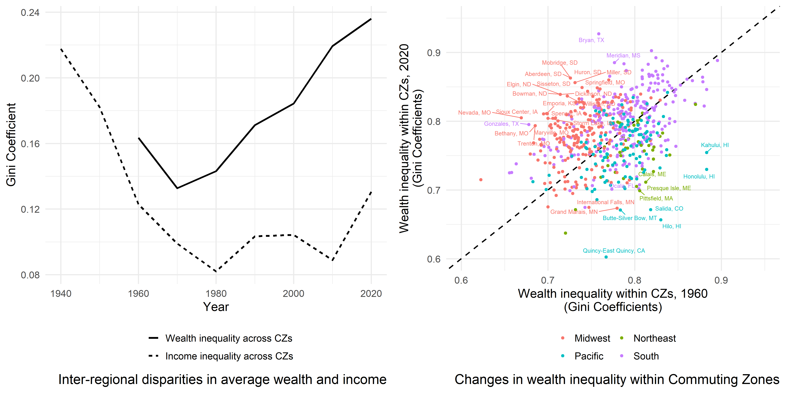

# GEOWEALTH: Spatial wealth inequality data for the United States, 1960-2020

This repo contains the code used to develop the GEOWEALTH dataset. 

The data is archived with ICPSR: https://www.openicpsr.org/openicpsr/project/192306/

* [Replication](#run)
* [Figures](#figures)

##  Replicate GEOWEALTH

1. Run the numbered files found in the `scripts` folder in order
2. Scripts to reproduce figures are in the `analysis`
   
##  Main figures  

