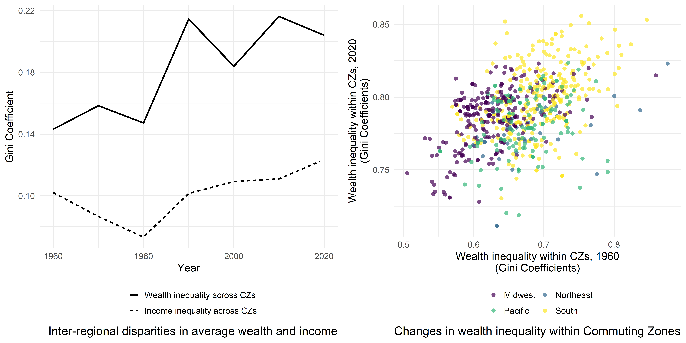

# GEOWEALTH-US: Spatial wealth inequality data for the United States, 1960-2020

This repo contains the code used to develop the GEOWEALTH dataset. 

The data is archived and downloadable at ICPSR: [https://doi.org/10.3886/E192306](https://doi.org/10.3886/E192306)

* [Figures](#figures)
* [Replication](#run)

##  Main figures  

##  Replicate GEOWEALTH

1. Run the numbered files found in the `scripts` folder in order
2. Scripts to reproduce figures are in the `analysis` folder
   
